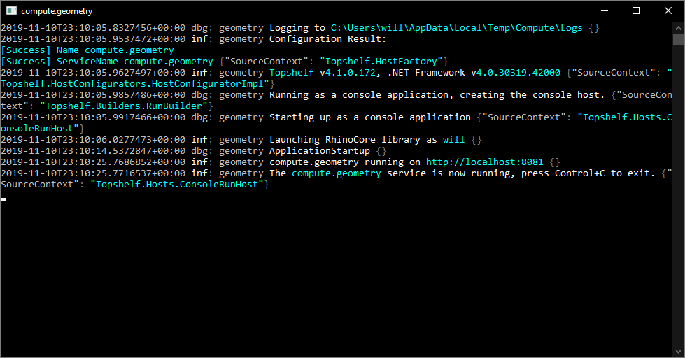

# Getting Started

The steps below assume that you have a Windows Server machine/VM ready to go. We recommend using the 2016/2019 (LTSC), but it's possible to use 1809, etc. (SAC) if you're comfortable without a desktop enviroment. Compute can also be run on Windows 10, of course.

1. Get the [latest build](https://ci.appveyor.com/project/mcneel/compute-rhino3d/branch/master/artifacts) from the `master` branch (or [build from source](#building-from-source)).
1. Log in/remote desktop onto your server.
1. Unzip _compute-<build_number>.zip_ and copy the entire `Release` folder to the server. (Hint: it may be in `src\bin\`.)
1. [Download](https://www.rhino3d.com/download/rhino/wip) and install the latest Rhino WIP.
1. Run Rhino at least once so that you can configure the license (we recommend Cloud Zoo) and validate it.
1. Start PowerShell, `cd path\to\Release` and run `& .\compute.frontend.exe`.
1. Open a browser and try navigating to `http://localhost/version`
1. For next steps, see [Configuration](#configuration) and [Running Compute as a service](#running-compute-as-a-service).

## Configuration

### URL reservation

Release builds of Compute listen on all available IP addreses by default. For this to work, you may need to:

1. Start PowerShell as Administrator.
1. For HTTP, `netsh http add urlacl url="http://+:80/" user="Everyone"`.
1. For HTTPS, `netsh http add urlacl url="https://+:443/" user="Everyone"`.

### Environment variables

All configuration of Compute is done via environment variables.
See [environment variables](environment_variables.md) for details

### HTTPS (optional)

HTTPS requires an SSL certificate. If you don't have one already, we recommend using [Let's Encrypt](https://letsencrypt.org).

- Configure a your domain name (e.g. compute.example.com) to point to your server's IP address
- Download [win-acme](https://pkisharp.github.io/win-acme/) and unzip
- Start PowerShell as Administrator
- Run `Install-WindowsFeature -name Web-Server -IncludeManagementTools` to install IIS
- cd to unzipped directory
- `& .\wacs.exe`
- `N` create new certificate
- `4` manually input host names
- `compute.example.com` (or similar)
- `1` for default web site
- Enter your email address when prompted
- `yes` to accept the license agreement
- `Q` to Quit

## Scaling when using the Cloud Zoo

Rhino WIP encrypts Cloud Zoo license information by default. In order to scale your compute service on Amazon Web Services or other PaaS services, you may need to disable encryption of the license information before creating your machine image.

1. Open Rhino on the template host machine
1. From the _Tools_ menu, click _Options_ then click _Advanced_
1. Search for `Rhino.LicensingSettings.CloudZooPlainText`
1. Select the checkbox to enable the plain text setting
1. **Important!** Close all instances of Rhino (Changes do not take effect until Rhino is restarted)
1. Start Rhino
1. Log back in to your Rhino Account
1. Close Rhino
1. Create your machine instance

## Running Compute as a service

Compute uses [TopShelf](https://github.com/topshelf/topshelf) to make it easy to configure and run it as a service on Windows.

1. Start PowerShell as Administrator
1. Run `cd path\to\Release\`
1. Run `& .\compute.frontend install` to install as a service
1. In the interactive menu, enter your username in the format `.\\[USERNAME]` (for example:`.\steve`) along with password for this account
1. **Note:** Make sure to run Rhino (and configure the license) at least once _as the user that the service will run as_!

## Building from source and debugging

1. [Download](https://www.rhino3d.com/download/rhino/wip) and install the latest Rhino WIP.
1. Start Rhino WIP at least once to configure its license.
1. Open `src\compute.sln` in Visual Studio 2017 (or later) and compile as `Debug`.
1. In _Solution Explorer_, right-click _Solution 'compute'_, then click _Properties_.
1. In the _Startup Project_ tab, select _Multiple Startup Projects_, then set both `compute.frontend` and `compute.geometry` to _Start_.
1. Start the application in the debugger.
1. Wait for the backend to load :coffee:.
    
1. Browse to http://localhost:8888/version to check that it's working!

## Notes

- There is a health check URL (`/healthcheck`) in case you want to set up a load balancer
